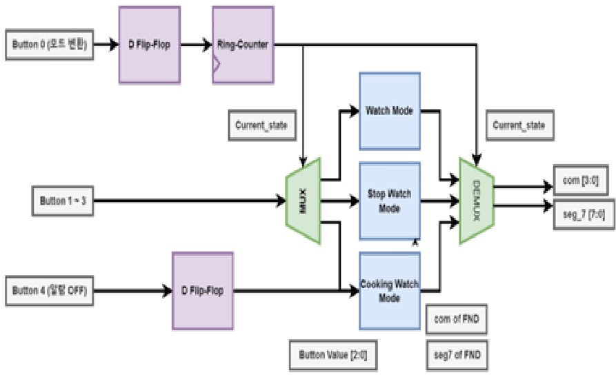
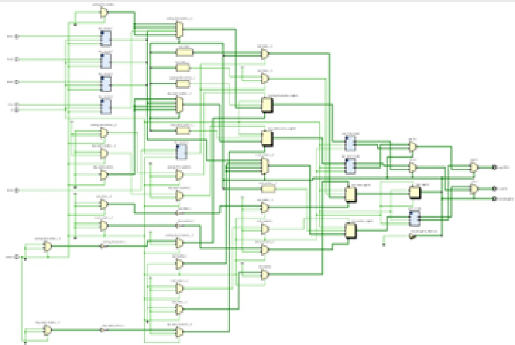

## Personal Project of Multifunction digital watch

### 1. 목적
- Basys3 FPGA 보드를 통하여 시계, 타이머, 알람을 구성하여 MUX와 7-Segment FND 등 디지털 회로 설계 및 검증 능력 향상

### 2. 프로젝트의 목표
- 분, 초 값을 갖는 일반 시계 모드 구현
- Lap 타임 기능을 탑재된 스톱 워치 기능 구현
- 필요한 시간을 설정하고, 이를 알려주는 Cooking Timer 기능 구현

### 3. 동작 모드

  

### 4. Block Diagram

  

### 5. RTL Schematic

  

  
